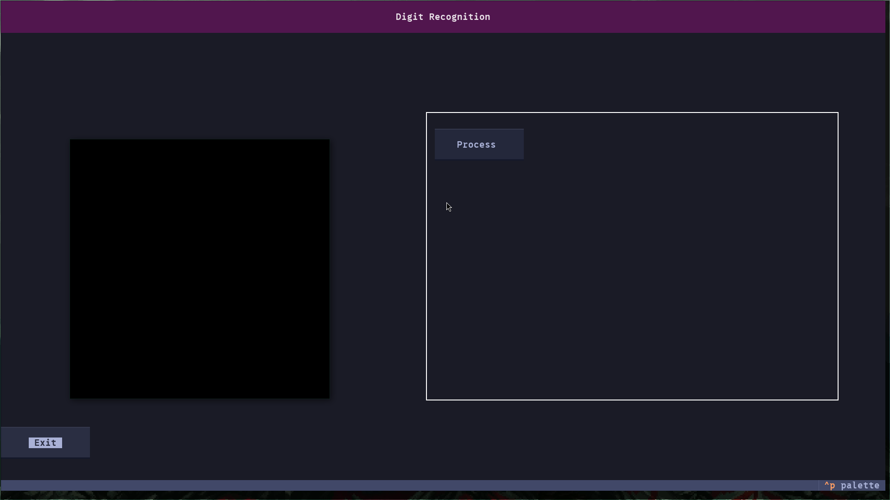

# TUI Handwriting-to-Text Classifier (ASCII Style)

A terminal-based user interface (TUI) for handwriting recognition, using `textual` for the interface and `pygame` as a drawing canvas.

## Features (So Far)
- **TUI Interface**: Built using `textual`, providing a clean and interactive terminal experience.
- **Drawing Canvas**: Implemented with `pygame`, allowing users to draw characters.
- **Process Button**: Saves the canvas image for later classification and will display top predictions when integrated with a trained model.
- **Reset Button**: Resets the canvas image if user wants.

## Dataset
We use the **EMNIST Dataset** for training and testing the handwriting recognition model.
More details and download the dataset here:
[EMNIST Dataset (nist.gov)](https://www.nist.gov/itl/products-and-services/emnist-dataset)

## Screenshots


## Setup
### Requirements
Make sure you have Python installed, then install dependencies:
```bash
pip install -r requirements.txt


